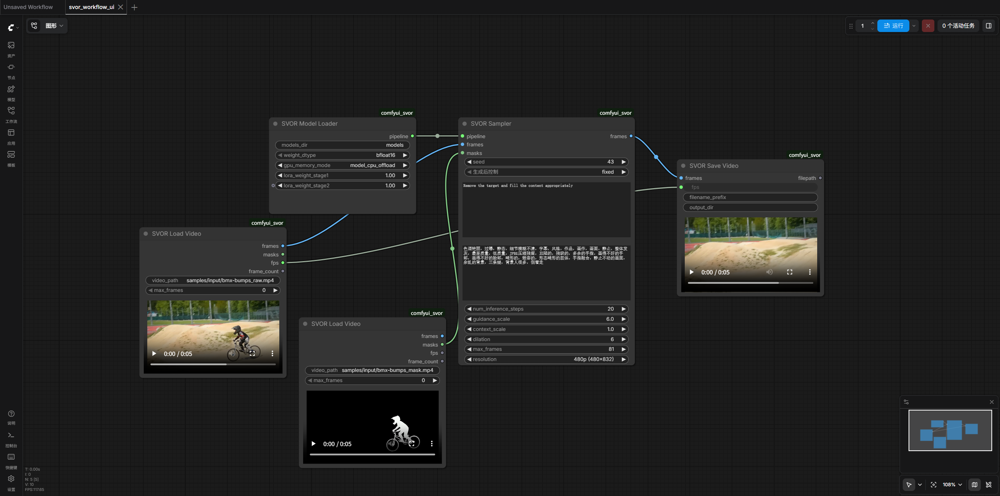

# ComfyUI-SVOR

ComfyUI-SVOR brings [SVOR](https://github.com/xiaomi-research/svor) video object removal into ComfyUI as a custom node package. It keeps the original inference pipeline and adds nodes for video loading, mask-guided removal, and video export.

ComfyUI is not bundled. Prepare a working ComfyUI environment first, then clone this repository into `custom_nodes`.

## Installation

Clone this repository into ComfyUI's `custom_nodes` directory:

```bash
cd /path/to/ComfyUI/custom_nodes
git clone https://github.com/Foxerity/ComfyUI-SVOR.git
cd ComfyUI-SVOR
```

Expected layout:

```text
ComfyUI/
+-- main.py
+-- custom_nodes/
    +-- ComfyUI-SVOR/
        +-- __init__.py
        +-- comfyui_svor/
        +-- videox_fun/
        +-- setup_comfyui.sh
```

### Linux / WSL

Use the setup script from the `ComfyUI-SVOR` directory:

```bash
bash setup_comfyui.sh
```

It installs the SVOR PyTorch stack, installs this package's dependencies, downloads missing weights, and imports `comfyui_svor/svor_workflow_ui.json` into ComfyUI. It does not install or start ComfyUI.

Useful options:

```bash
bash setup_comfyui.sh --skip-install
bash setup_comfyui.sh --skip-torch
bash setup_comfyui.sh --install-flash-attn
bash setup_comfyui.sh --skip-weights
bash setup_comfyui.sh --models-dir /path/to/svor_models
PYTHON_BIN=/path/to/python bash setup_comfyui.sh
```

By default, the PyTorch versions follow the original SVOR setup:

```text
torch==2.7.0 torchvision==0.22.0 torchaudio==2.7.0
```

### Windows

The bash script is intended for Linux/WSL. On native Windows, install dependencies in the Python environment used by ComfyUI:

```powershell
python -m pip install torch==2.7.0 torchvision==0.22.0 torchaudio==2.7.0
python -m pip install -r requirements.txt
```

Then prepare the weights manually under:

```text
ComfyUI/custom_nodes/ComfyUI-SVOR/models/
+-- Wan2.1-VACE-1.3B/
+-- remove_model_stage1.safetensors
+-- remove_model_stage2.safetensors
```

`Wan2.1-VACE-1.3B/` is the base model directory. The two `remove_model_stage*.safetensors` files are [SVOR LoRA weights](https://huggingface.co/HigherHu/SVOR). If you keep weights elsewhere, set the `models_dir` field in the `SVOR Model Loader` node to that absolute path.

To import the workflow manually, copy:

```text
ComfyUI-SVOR/comfyui_svor/svor_workflow_ui.json
```

to:

```text
ComfyUI/user/default/workflows/svor_workflow_ui.json
```

## Usage

After setup, restart ComfyUI and open the imported workflow:

```text
svor_workflow_ui.json
```

The default workflow connects video input, mask input, SVOR inference, and video export.



## Nodes

### SVOR Model Loader

Loads the base model and SVOR LoRA weights as a reusable pipeline.

| Group | Parameters |
| --- | --- |
| Inputs | `models_dir`, `weight_dtype`, `gpu_memory_mode` |
| Optional | `lora_weight_stage1`, `lora_weight_stage2` |
| Outputs | `pipeline` (`SVOR_PIPELINE`) |

### SVOR Load Video

Reads a video file as frames; the same node can load mask videos.

| Group | Parameters |
| --- | --- |
| Inputs | `video_path` |
| Optional | `max_frames` |
| Outputs | `frames` (`IMAGE`), `masks` (`MASK`), `fps` (`FLOAT`), `frame_count` (`INT`) |

### SVOR Sampler

Runs mask-guided video object removal.

| Group | Parameters |
| --- | --- |
| Inputs | `pipeline`, `frames`, `masks`, `seed` |
| Optional | `prompt`, `negative_prompt`, `num_inference_steps`, `guidance_scale`, `context_scale`, `dilation`, `max_frames`, `resolution` |
| Outputs | `frames` (`IMAGE`) |

### SVOR Save Video

Saves generated frames as an MP4 file and shows a preview in ComfyUI.

| Group | Parameters |
| --- | --- |
| Inputs | `frames`, `fps` |
| Optional | `filename_prefix`, `output_dir` |
| Outputs | `filepath` (`STRING`) |

The default output directory is `samples/SVOR/`.

## 致谢

- 原始项目：[SVOR](https://github.com/xiaomi-research/svor), by Xiaomi Research
- 论文全称：From Ideal to Real: Stable Video Object Removal under Imperfect Conditions
- ComfyUI 集成：[ComfyUI-SVOR](https://github.com/Foxerity/ComfyUI-SVOR)

## License

本项目基于 Apache License 2.0 发布，继承自 Xiaomi Research 的 SVOR 项目协议。

## 引用

如果本项目或 SVOR 对你的工作有帮助，请引用原论文：

```bibtex
@article{hu2026svor,
   title={From Ideal to Real: Stable Video Object Removal under Imperfect Conditions},
   author={Hu, Jiagao and Chen, Yuxuan and Li, Fuhao and Wang, Zepeng and Wang, Fei and Zhou, Daiguo and Luan, Jian},
   journal={arXiv preprint arXiv:2603.09283},
   year={2026}
}
```
